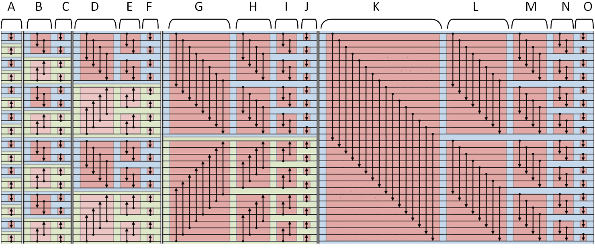

# Bitonic Sort

Tugas OpenMP - Bitonic Sort. Praktikum1_K01_13515097

## Petunjuk penggunaan program

1. Buka terminal, jalankan make
    ```sh
    $ make
    ```
2. Untuk menjalankan program, ketik
    ```sh
    $ ./bitonic_sort <n> <p>
    ```
    - <n> : problem size / banyaknya elemen random
    - <p> : thread number (optional) (default : ``omp_get_max_threads``)

## Pembagian tugas

| NIM | Nama | Fungsi |
| ------ | ------ | ------ |
| 13515097 | Dery Rahman A | All |

## Laporan

### Deskripsi solusi paralel
Bitonic sort merupakan salah satu teknik sorting network yang dapat diparalelkan, dengan kompleksitas O(log<sup>2</sup>n). Konsep bitonic sort sendiri yaitu dengan membuat bitonic sequence pada tiap iterasinya. Sequence ``0..n`` dikatakan **bitonic increasing** jika terdapat subsequence ``0..a`` menaik, dan ``a..n`` menurun, dan dikatakan **bitonic decreasing** jika terdapat subsequence ``0..a`` menaik, dan ``a..n`` menurun ``(0<=a<=n)``.

Untuk mendapatkan sequence bitonic, dapat dilakukan dengan cara membandingkan 2 buah nilai pada sequence, dengan sequence perbandingan yang independent terhadap data (perbandingan antara 2 nilai dengan perbandingan antara 2 nilai yang lain tidak saling bergantung). Sehingga, pada titik inilah kita dapat memparalelkan.

<div style="text-align:center"></div>
<p style="text-align: center;">Ilustrasi 1.1</p>

Pertama, membuat ``bitonic increasing`` pada masing-masing subsequence yg berjumlah 4 buah. Kemudian 8 buah, 16 buah, hingga 2*n buah (n merupakan panjang sequence).

Terdapat ``N=log2(n)`` kali iterasi ``(k=1,2..N)`` untuk membuat ``bitonic increasing`` subsequence. Pada iterasi ke-k, terdapat ``M=k`` kali iterasi ``(j=1,2..M)`` yang akan melakukan proses pembuatan ``bitonic increasing`` subsequence. Pada contoh ilustrasi, terdapat ``n=32``, sehingga terdapat 5 iterasi, dengan iterasi ``k`` ke-1, terdapat 1 iterasi ``(A)``, ke-2, 2 iterasi ``(B,C)``, ke-3, 3 iterasi ``(D,E,F)``, ke-4, 4 iterasi ``(G,H,I,J)``, dan yang ke-5, 5 iterasi ``(K,L,M,N,O)``. Masing-masing iterasi tadi (A,B,C,D...O), terdapat ``n/2`` buah perbandingan yang dapat diparalelkan.

Pada ilustrasi, kolom A,B,C,...O dapat dilakukan secara paralel, karena data tidak saling bergantung ketika dilakukan operasi perbandingan.

### Analisis solusi
Solusi yang saya buat adalah dengan melakukan paralelisasi pada bagian operasi perbandingan. Dengan menggunakan 2 thread, saya mendapatkan peningkatan kecepatan sebesar ~2x lipat jika dibandingkan dengan serial. Pada iterasi ke k ``(k=1,2,3...N)`` ``(N=log2(n))``, setiap thread akan melakukan operasi perbandingan setidaknya ~``k*(n/2)/t`` perbandingan (t = jumlah thread).

Pada dasarnya bitonic sort hanya bisa melakukan sorting elemen yang berjumlah 2 pangkat. Oleh karena itu, untuk menghandle elemen yang tidak berjumlah 2 pangkat, saya membuat elemen dummy, yaitu elemen maximum pada ``N`` buah elemen, kemudian menambahkan isi sequence dengan ``dummyN-N`` buah elemen. ``dummyN`` merupakan bilangan 2 pangkat terdekat setelah ``N``.

**Solusi kinerja yang lebih baik**

Untuk jumlah kasus yang besar dengan jumlah elemen yang bukan 2 pangkat, tentu dengan membuat elemen dummy membuat komputer melakukan operasi perbandingan yang tidak diperlukan, oleh karena itu, mungkin bisa dilakukan [solusi lain](http://www.iti.fh-flensburg.de/lang/algorithmen/sortieren/bitonic/oddn.htm)

Selain itu, bisa juga dengan meminimalkan komunikasi dan mengoptimasi *local computation* [sumber](http://web.mst.edu/~ercal/387/slides/Bitonic-Sort97.pdf)

Solusi lain, bisa dengan menambahkan core, sehingga bisa menambah maksimum thread yg efektif.

### Jumlah thread
Saya menggunakan jumlah thread sebanyak 2 buah dikarenakan jumlah core pada komputer saya berjumlah 2 buah core. Jika menggunakan thread lebih dari banyaknya core pada komputer tersebut, maka akan timbul overhead yang dapat menurunkan kinerja. Oleh karena itu, saya menggunakan fungsi ``omp_get_max_threads();`` untuk mendapatkan maksimum thread yang dapat bekerja dengan baik pada komputer tersebut.

### Pengukuran kinerja
Berikut adalah hasil dari pengukuran kinerja dengan jumlah elemen 5000, 50000, 100000, 200000, 400000. Setiap pengujian dilakukan sebanyak 3 kali dan dihitung rata-ratanya. Prosesor yang digunakan adalah 2,3 GHz Intel Core i5 (7360U) 2 cores.


| | N | Percobaan 1 | Percobaan 2 | Percobaan 3 | Avg | Speedup |
| ------ | ------ | ------ | ------ | ------ | ------ | ------ |
| **Serial time** (micro second) | 5000 | 3657 | 3447 | 3745 | 3616.333 | - |
| **Paralel time** (micro second) | 5000 | 2454 | 2410 | 2353 | 2405.667 | **1.503x** |
| **Serial time** (micro second) | 50000 | 53295 | 57043 | 46795 | 52377.667 | - |
| **Paralel time** (micro second) | 50000 | 27071 | 34690 | 36051 | 32604 | **1.606x** |
| **Serial time** (micro second) | 100000 | 98679 | 95753 | 102108 | 98846.667 | - |
| **Paralel time** (micro second) | 100000 | 55557 | 61413 | 55448 | 57472.667 | **1.719x** |
| **Serial time** (micro second) | 200000 | 204232 | 194476 | 197580 | 198762.667 | - |
| **Paralel time** (micro second) | 200000 | 110442 | 110062 | 108968 | 109824 | **1.809x** |
| **Serial time** (micro second) | 400000 | 422364 | 428631 | 451095 | 434030 | - |
| **Paralel time** (micro second) | 400000 | 241812 | 237605 | 242812 | 240743 | **1.803x** |

### Analisis perbandingan kinerja
Pada percobaan  terlihat bahwa speedup cenderung semakin tinggi ketika problem size ditingkatkan. Hal ini dikarenakan peningkatan ``T``<sub>overhead</sub> lebih kecil dibandingkan dengan ``T``<sub>serial</sub>. Oleh karena itu, semakin besar problem size, ``T``<sub>paralel</sub> = ``T``<sub>serial</sub>/p + ``T``<sub>overhead</sub>, bisa semakin berkurang.
